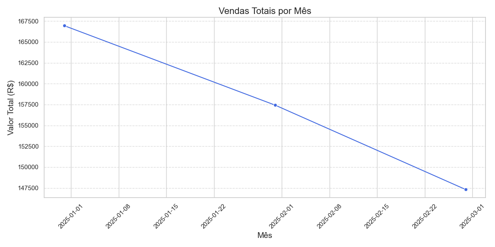
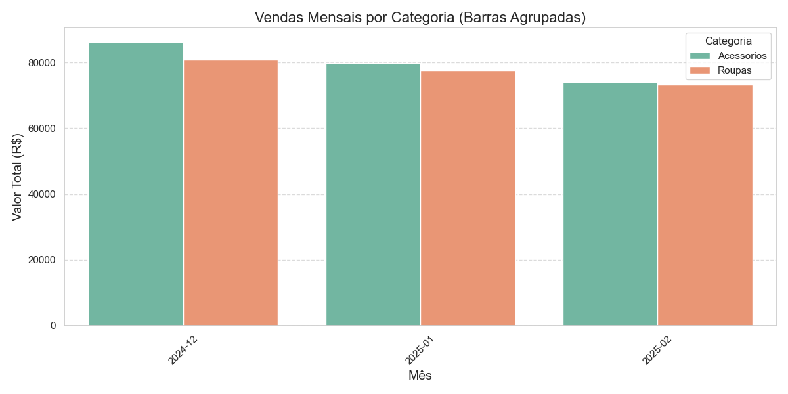
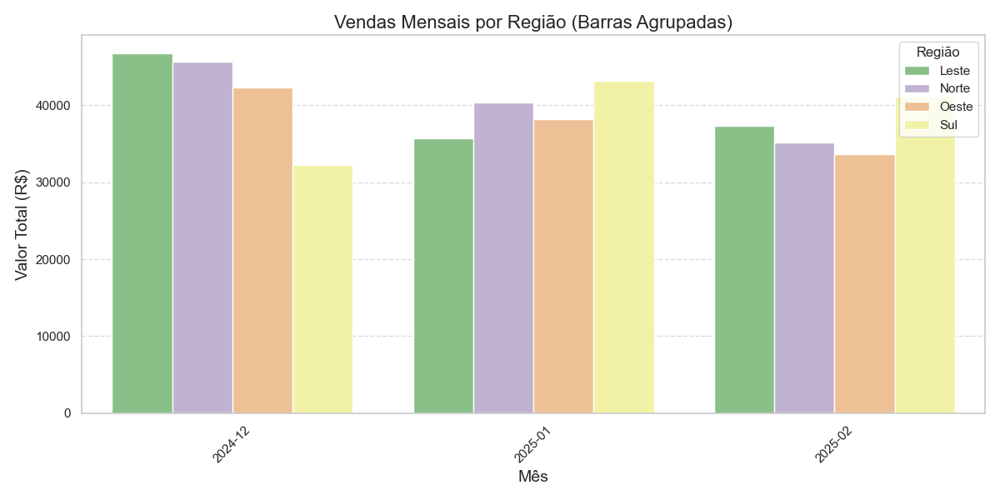
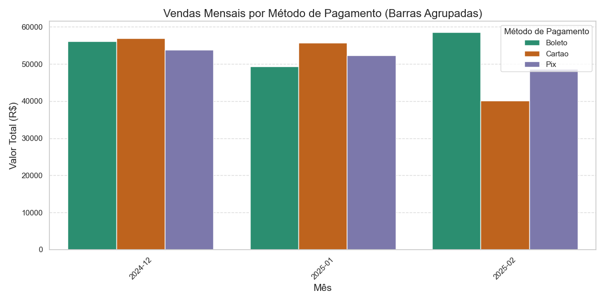

# 🛒 Análise de Vendas - Loja Online de Roupas e Acessórios


> **Projeto desenvolvido para consolidar habilidades em Análise de Dados utilizando Python e bibliotecas de visualização.**

---

## 💡 Objetivo do Projeto
O objetivo deste projeto é analisar as vendas de uma loja online de roupas e acessórios ao longo de três meses, identificar padrões e possíveis problemas que estão impactando as vendas e propor estratégias para aumentar o faturamento.

---

## 🗂️ Estrutura do Projeto

```
📁 projeto-analise-vendas
├── 📄 dados_vendas_lojas.csv     # Conjunto de dados com as vendas da loja
├── 📄 vendas_lojas.py            # Script Python com a análise de dados
├── 📄 grafico_vendas_totais.png  # Gráfico de Vendas Totais por Mês
├── 📄 grafico_vendas_por_categoria.png # Gráfico de Vendas por Categoria
├── 📄 grafico_vendas_por_regiao.png # Gráfico de Vendas por Região
├── 📄 grafico_metodos_pagamento.png # Gráfico de Métodos de Pagamento
└── 📄 README.md                  # Documentação do projeto
```

---

## 🚀 Tecnologias Utilizadas
- **Python:** Linguagem principal para manipulação e análise de dados.
- **Pandas:** Análise e manipulação de dados.
- **Matplotlib:** Criação de gráficos e visualização de tendências.
- **Seaborn:** Gráficos estilizados e visualizações aprimoradas.

---

## 🔥 Como Executar o Projeto

### Pré-requisitos
- Python 3.9+
- Instalar as bibliotecas necessárias:
  ```
  pip install pandas matplotlib seaborn
  ```

### Executando o Script
Basta rodar o script diretamente:
```
python vendas_lojas.py
```

---

## 📊 Análises Realizadas

### 1. 📅 Análise Mensal de Vendas
- Identificação de tendências de vendas ao longo dos últimos três meses.
- Gráfico de linha mostrando a variação das receitas.

#### **Gráfico de Vendas Totais por Mês**
O gráfico de linha apresenta as variações mensais de faturamento, permitindo identificar períodos de queda ou aumento nas vendas.

---

### 2. 🛍️ Análise por Categoria
- Comparação entre as categorias de produtos ao longo dos meses.
- Gráfico de barras agrupadas para visualização clara.

#### **Gráfico de Vendas por Categoria (Barras Agrupadas)**
Cada barra representa uma categoria específica, agrupada por mês, facilitando a comparação direta entre os diferentes tipos de produtos.

---

### 3. 🌎 Análise por Região
- Comparação entre as regiões que mais contribuíram para o faturamento.
- Gráfico de barras agrupadas para facilitar a interpretação.

#### **Gráfico de Vendas por Região (Barras Agrupadas)**
Cada barra corresponde a uma região específica dentro de cada mês, permitindo identificar quedas significativas em determinadas localidades.

---

### 4. 💳 Análise por Método de Pagamento
- Verificação da correlação entre os métodos de pagamento e as vendas.
- Gráfico de barras agrupadas para visualizar os métodos mais utilizados e a relação entre eles.

#### **Tabela de Correlação entre Métodos de Pagamento**
| Boleto | Cartão | Pix |
|-------|-------|-----|
| 1.000 | -0.658 | -0.463 |
| -0.658 | 1.000 | 0.972 |
| -0.463 | 0.972 | 1.000 |

---

## ✅ Resultados da Análise
1. 💡 **Categoria com Maior Queda:** Acessório  
2. 🌍 **Região com Maior Queda:** Leste  
3. 💳 **Correlação entre Métodos de Pagamento:**  
   - A correlação mais forte foi entre **Cartão e Pix (0.972)**, indicando que os dois métodos andam juntos.  
   - Entretanto, a queda nas vendas não está diretamente relacionada aos métodos de pagamento.  

---

## 🎯 Insights e Recomendações
1. 💡 **Promoções Focadas:** Descontos específicos na categoria "Acessório" para estimular as vendas.  
2. 🌍 **Marketing Regionalizado:** Aumentar campanhas na **Região Leste** para retomar o fluxo de vendas.  
3. 💳 **Ações para Métodos de Pagamento:** Apesar da forte correlação entre Cartão e Pix, a queda de vendas não está diretamente ligada a eles.  

---

## 📝 Principais Correções no Código
1. **Gráficos de Barras Agrupadas:**  
   - Corrigido para garantir que as barras de cada categoria e região sejam exibidas separadamente, facilitando a comparação direta.  

2. **Gráficos Intuitivos e Claros:**  
   - Aplicado o tema `whitegrid` do Seaborn para melhorar a visualização.  
   - Títulos e legendas mais descritivos para facilitar a interpretação.  

3. **Correção de Problemas com Janelas Duplas:**  
   - Garantido o uso correto de `plt.figure()` para cada gráfico, evitando sobreposição.  

---

## 📧 Contato
Caso queira trocar ideias ou colaborar, me envie uma mensagem!  
[LinkedIn](https://www.linkedin.com/in/marcoagalvao/)  
